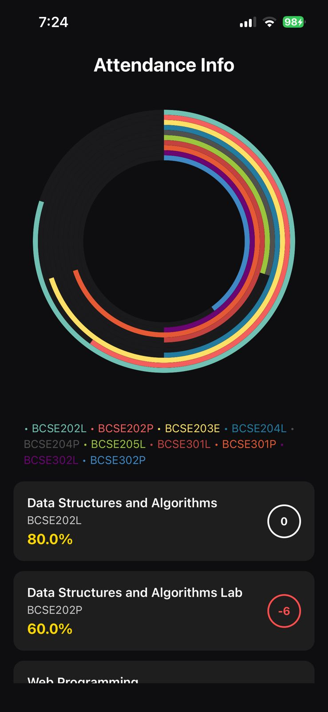
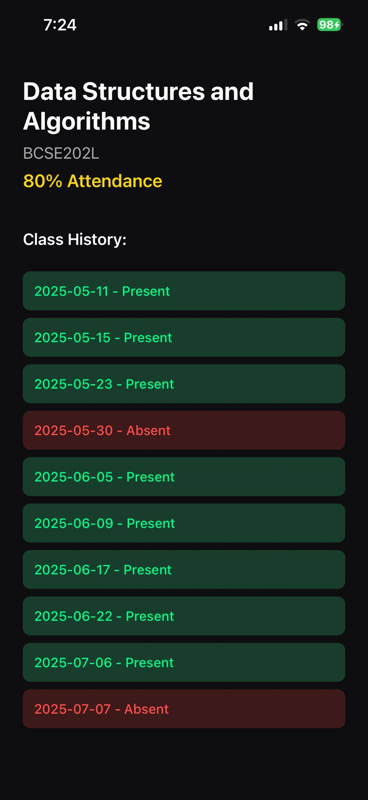

# 📊 Attendance Tracker App (React Native + Expo)

A beautiful and intuitive app to visualize student attendance using animated progress rings. 
Built with **React Native**, **Expo Router**, and data-driven UI from local JSON.

## ✨ Features

- Animated multi-layer attendance ring.
- Individual cards for each subject with color-coded metrics.
- Real-time skip/bunk class predictor for 75% threshold.
- Detailed view with date-wise presence/absence breakdown.
- Clean dark UI inspired by health-tracker aesthetics.

## 📁 Folder Structure

```
📦app/
 ┣ 📂subject/
 ┃ ┗ 📜[code].tsx         # Dynamic detail page
 ┣ 📜_layout.tsx
 ┣ 📜app.tsx
📦components/
 ┗ 📜attendanceScreen.tsx # Main screen logic
📦data/
 ┗ 📜attendance.json       # Sample attendance data
```

## 📷 Screenshots

| Main Attendance Ring | Subject Detail View |
|----------------------|---------------------|
| |  |

## 🛠️ Getting Started

```bash
git clone <your-repo>
cd attendance-app
npm install
npx expo start
```

Ensure your `attendance.json` contains:
```json
{
  "code": "BCSE202L",
  "name": "Data Structures and Algorithms",
  "classesHeld": 10,
  "classesAttended": 8,
  "details": [
    { "date": "2025-05-31", "status": "Absent" }
  ]
}
```


## 📄 License

MIT © 2025 Atul Bharti